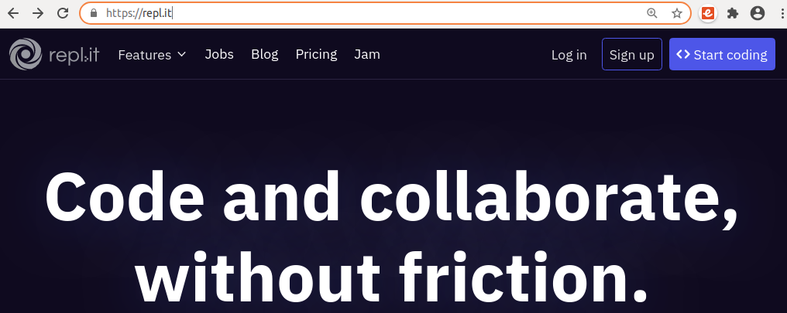
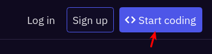
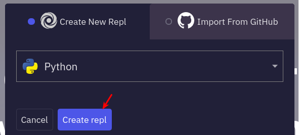
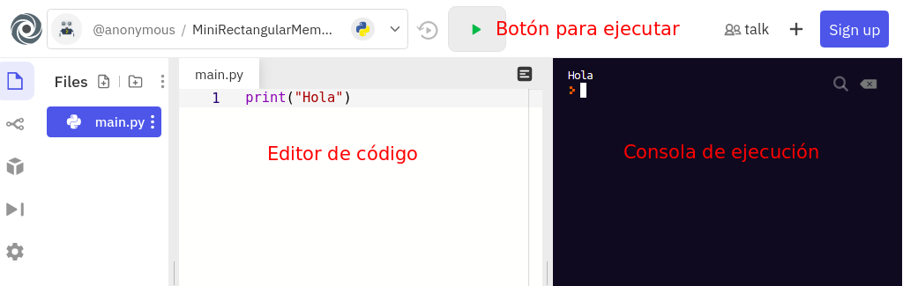

2       El entorno
==================

En cualquier ordenador con conexión a Internet, accede a:

https://repl.it/

Site de replt.it

Desde ahí puedes pulsar el botón Start coding:

Start Coding en replt.it

Y seleccionar el lenguaje Python:

Selección de Python en replt.it

Una vez hecho, se cargará el entorno de programación:

Entorno de desarrollo de replt.it

- A la izquierda, tienes el editor donde puedes escribir el programa

- A la derecha, la consola, donde verás el resultado cuando ejecutes el programa

- En la parte superior, el botón Run con el que podrás ejecutar el programa tantas veces como quieras.

Te recomendamos que te des de alta en el sitio repl.it. De esa manera podrás tener guardados y localizados todos los programas que vayas haciendo.

Otras alternativas online:

- https://paiza.io/es

- https://www.programiz.com/python-programming/online-compiler/