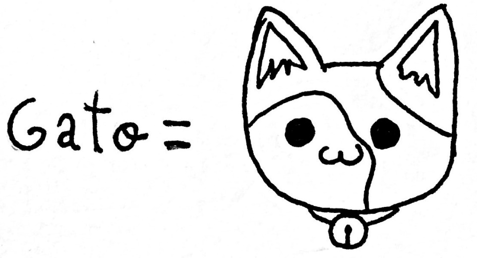

4       Variables
=================



Las variables sirven para guardar datos. Los programas de ordenador se dedican, básicamente, a manejar datos para solucionar un problema y ofrecer un resultado. En todo ese proceso es necesario guardar datos, y para eso se utilizan las variables. Las variables son como contenedores de datos. En cierto modo es como los vasos, platos, fuentes que se utilizan para cocinar: contienen algo, se trabajo con ello, se mezcla, se procesa y se consigue un resultado: con un poco de suerte algo rico.

Para definir una variable en python basta con indicar su nombre y darla algún valor. Por ejemplo:

```Python
izena = "Ada"
```

Acabamos de crear una variable que contiene el valor "Ada". "Ada" es un dato, y es de tipo texto. Ahora podemos mostrar el valor de esa variable por la pantalla:

```Python
print(izena)
```

Que por pantalla sería:

```console
Ada
```

En cualquier momento, podríamos cambiar el valor de esa variable:

```Python
izena = "Ada"
print(izena)
izena = "Neko"
print(izena)
```

Y por pantalla veríamos:

```console
Ada
Neko
```

Nota:

También se puede mostrar el contenido de una variable como parte del mensaje. Existen varias opciones que veremos a continuación.

4.1  Mostrar variables por pantalla
-----------------------------------

### 4.1.1    Separar por comas

Basta con intercalar las variables y el texto con comas:

```Python
izena = "Bug"
adina = 10
print("Kaixo nire izena", nombre, "da")
print(nombre,"naiz", edad, "urte ditut")
```

Que por pantalla sería:

```console
Kaixo nire izena Bug da
Bug naiz, 10 urte ditut
```

### 4.1.2    ¡Ahora tú! Ejercicio 0.1

Crea dos variables nombre y edad y muestra su valor por pantalla.

```Python
izena = "Ada"
adina = 34
print("Zure izena da", izena, ",", adina, "urte dituzu")
# print("Zure izena da %s, %d urte dituzu" % (izena, adina))
```

Resultado:

```console
Zure izena da Ada, 34 urte dituzu.
```

### 4.1.3    String de formato

Otra forma de mostrar varias variables es con un mensaje que precedido de la letra f y las variables entre llaves:

```Python
izena = "Bug"
adina = 10
print(f"Kaixo nire izena {izena} da")
print(f"{izena} naiz {adina} urte ditut")
```

Que por pantalla sería:

```console
Kaixo nire izena Bug da
Bug naiz, 10 urte ditut
```

¡OJO!

Ésta opción solo está disponible desde Python 3.6

### 4.1.4    Sustitución de porcentaje

Otra alternativa para mostrar variables por pantalla: se crea un mensaje donde los elementos %s son sustituidos por variables.

```Python
print("Kaixo nire izena %s da" % izena)
```

Que por pantalla sería:

```console
Kaixo nire izena Bug da
```

Puedes hacer lo mismo con varias variables

```Python
izena = "Neko"
izena = 5

print("Kaixo, %s naiz eta %d urte ditut" % (izena, izena))
```

Que por pantalla sería:

```console
Kaixo, Neko naiz eta 5 urte ditut
```