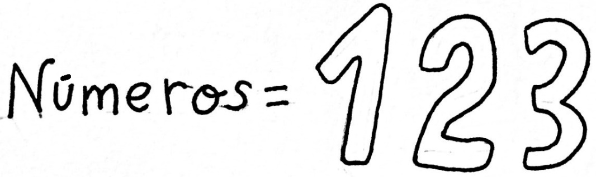
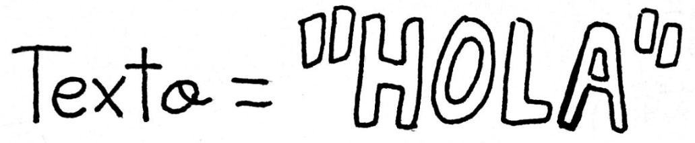
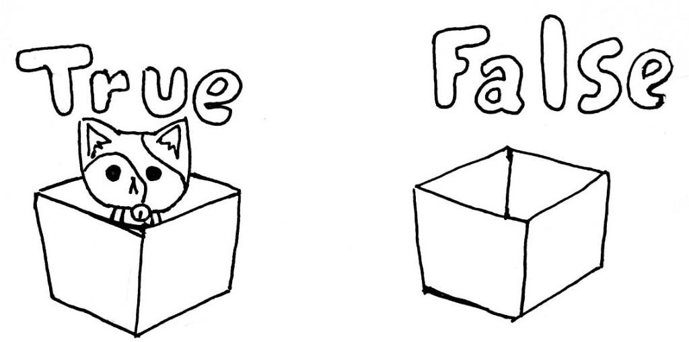
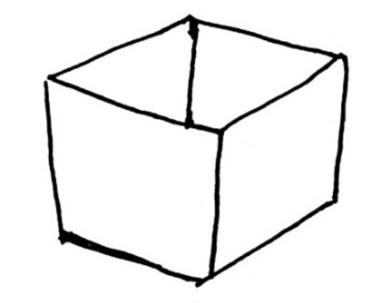

5       Tipos de datos
======================

¡Datos!

Es la materia prima con la que trabajan los programas. Son el elemento que nuestros programas transforman. Un programa recibe datos, los transforma y los devuelve como un resultado. Los datos pueden ser de distinto tipo, según lo que nuestro programa tenga que hacer. Pueden ser números, puedes ser palabras o textos, pueden incluso ser nulos o vacíos. Para guardar los datos, generalmente usamos variables. Si comparamos la programación con la cocina, entonces el azúcar, la harina y los huevos serían datos, los recipientes serían variables: la tarta sería otro dato, el resultado y la receta sería el programa. ¿Cómo sabe Python que tipo de dato maneja? No hace falta indicárselo como en otros lenguajes. Por eso es un lenguaje más simple y flexible. Aunque tampoco podremos hacer lo que nos de la gana con los datos.

A continuación, vamos a ver los tipos básicos de datos.

5.1  Números
------------



Se trata de todos los tipos de números:

*   Enteros: 1, 2, 3, 4,...

```Python
contador = 10
edad = 12
```

*   Con decimales: Los números con decimales se expresan utilizando un . para separar la parte entera de la decimal, como 4.5 o 3.1415. Es probable que en clase de mates utilices una coma para separar las decimales, pero en programación se usa el formato inglés y debemos usar un ..

```Python
peso = 34.67
precio = 242.9943
```

- Negativos: Los números menores que 0 se expresan con un guión por delante: -4, -5, -3.1415,...

```Python
nota = -5
temperaturaEnMarte = -50.676
```

5.2  Texto
----------



El texto, también llamados cadenas o strings son cualquier conjunto de palabras entre comillas dobles o simples.

```Python
nombre = "Ada"
frase = ""
palabras = 'Voy a trabajar'
novia = 'Solo quiero que seamos "amigos"'
```

En el caso del texto, podemos meter una serie de caracteres especiales que nos permiten efectos interesantes. Esos caracteres se escriben con una contra-barra o backslash por delante:

- Salto de linea Esto añade un salto de línea al texto si este se muestra por pantalla:

```Python
frase = "Hola,\n qué tal"
```

se mostrará así:

```console
Hola,
qué tal
```

También se puede definir un texto de varias líneas así:

```Python
cancion = """Era un domingo
a la tarde
fui a los coches
de choque"""
```

• Tabulaciones Esto añade una tabulación (varios espacios) al texto si este se muestra por pantalla:

```Python
frase = "Nombre\tApellidotEdad"
```

se mostrará así:

```console
Nombre  Apellido   
```

Otros caracteres especiales:

-  `\\` Para mostrar la contra-barra en un texto.

- `\"` Para mostrar una comilla doble en un texto.

- `\'` Para mostrar una comilla simple en un texto.

- `\a` Para hacer sonar un pitido.

5.3  Booleanos
--------------



El tipo booleano solo puede tener dos valores posibles: True o False, es decir verdadero o false. Se trata de un tipo de dato fundamental en programación ya que se utiliza para tomar decisiones.

```Python
terminado = False
esMayor = True
pythonMola = True
```

5.4  Listas
-----------

Las listas son conjuntos de datos, que se definen de la siguiente manera:

```Python
amigas = ["Ada", "Miranda", "Ruby"]
```

Pueden ser de cualquier tipo, pero lo normal es que todos los elementos de una lista sean del mismo tipo:

```Python
enemigas = []  # lista vacía
edades = [12, 16, 30, 0, 22, 1, 1, 12]
verdades = [True, False, False, True]
```

Para poder referirnos a un valor concreto de la lista, tenemos que indicar la posición del elemento de la lista que nos interesa, empezando desde 0:

```Python
nombres = ["Ada", "Neko", "Bug"]
print(nombres[0])  # "Ada"
```

En el caso de la lista nombres, las posiciones posibles serán 0, 1 y 2. ¡Pero ojo! si pasas una posición demasiado grande, el programa terminará con error:

```Python
nombres = ["Ada", "Neko", "Bug"]
print(nombres[4])  # ¡ERROR!
```

Volveremos sobre las listas y otras estructuras más adelante.

5.5  None
---------



Aunque suene un poco raro, en los programas a veces hay que tratar con algo que representa el vacío, la nada. Existe una palabra que nos permite representar la nada en Python, y esa es: None

```console
valorInicial = None
dato = None
```

En realidad no se suele utilizar para crear variables. None representa un valor en situaciones especiales. Por ejemplo, si se trata de sacar información de un sitio en el que no hay nada como un fichero, o un dato que el usuario no nos da.

### 5.5.1    Ejercicio 0.2

Escribe un programa que defina una variable de cada tipo visto aquí, y los muestre por la consola.

```Python
nombre = "Ada"
edad = 42
peso = 101.54
vivo = True
riquezas = None
amigas = ["Ada", "Ruby", "Miranda"]

print(nombre)
print(edad)
print(peso)
print(vivo)
print(riquezas)
print(amigas)
```

Resultado:

```console
Ada
42
101.54
true
null
["Ada", "Ruby", "Miranda"]
```
