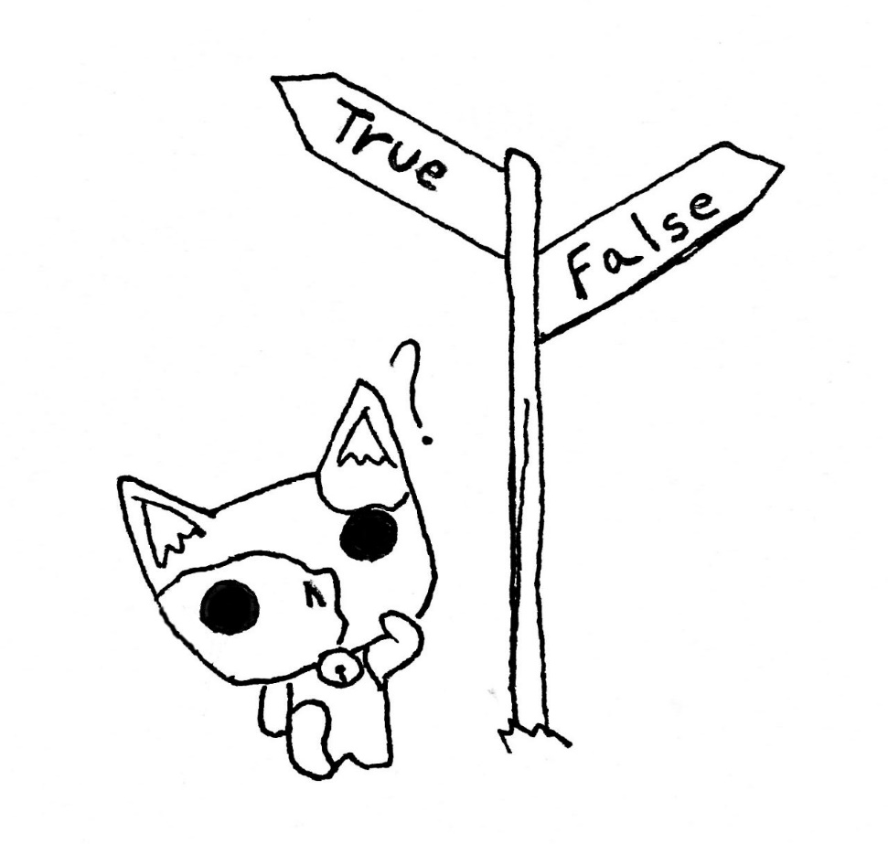

8       Condiciones
===================



En algún momento, los programas necesitan hacer una cosa u otra dependiendo de una condición. Por ejemplo, si un usuario introduce un dato incorrecto, el programa se acaba. Si un dato tiene determinado valor, se procesa de una forma y si no, de otra. ¿Cómo se consigue ese comportamiento? Mediante condiciones.

Las condiciones son estructuras de programación que nos permiten que un código se ejecute solo cuando se cumplan unas condiciones.

8.1  if
-------

La estructura más simple para hacer una condición es el if, el cual tiene este aspecto:

```Python
if *baldintza*:
    *eragiketak*
    *eragiketak*
    *...*
```

Como puedes observar, if comienza con una condición. La condición puede ser cualquier expresión que devuelva un booleano, es decir, será True o False, verdadero o falso. Si es True, las instrucciones dentro del if se ejecutarán, y si no se saltarán. Por ejemplo:

```Python
balioa = -2
if balio < 0:
    print("Balioa 0 baino txikiagoa da")
print("Programaren amaiera")
```

Resultaría en:

```console
Balioa 0 baino txikiagoa da
Programaren amaiera
```

En cambio:

```Python
balioa = 5
if balioa < 0:
    print("Balioa 0 baino txikiagoa da")
print("Programaren amaiera")
```

Resultaría en:

```console
Programaren amaiera
```

Nota:

También debes observar algo muy importante: las instrucciones dentro del if van detrás de unos espacios o una tabulación. Esa es una peculiaridad del lenguaje de programación Python: en cualquier bloque como una condición, un bucle, una función, su contenido debe ir tabulado. Esa es una forma que facilita la lectura y permite reconocer fácilmente la estructura de un programa para otros programadores. Incluso para ti mismo si es tu propio programa.

### 8.1.1    Ejercicio 1.0

Escribe un programa que solicite un número al usuario y compruebe si es negativo. So es negativo, debe mostrar un mensaje por consola.

```Python
balioa = input("Idatzi zenbaki bat: ")

if int(balioa) < 0:
    print("Negatiboa da")
```

Resultado:

```console
Idatzi zenbaki bat:  -5
Negatiboa da
```

8.2  if else
------------

Con el if podemos crear un bloque que solo se ejecute si se cumple una condición. Pero ¿Qué pasa si queremos que el programa haga una cosa u otra según una condición? Para poder meter "la otra" opción, utilizamos una estructura if-else:

```Python
if *baldintza*:
    *eragiketak*
else:
    *eragiketak*
```

Por ejemplo:

```Python
izena = input("Eman zure izena: ")
if izena != "":
    print("Kaixo ", izena)
else:
    print("Ez duzu ezer sartu!")
```

Podría verse algo así, según lo que meta el usuario:

```console
Eman zure izena: Ada
Kaixo Ada
```

Pero si el usuario simplemente pulsa enter sin escribir nada:

```console
Eman zure izena:
Ez duzu ezer sartu!
```

### 8.2.1    Ejercicio 1.1

Escribe un programa que solicite un texto al usuario. Si el texto es "saluda" debe mostrar un saludo, en caso contrario debe mostrar un mensaje que diga "no entiendo".

```Python
texto = input("Sartu testua: ")

if texto == "saludo":
    print("Kaixo!")
else:
    print("Ez dut ulertzen.")
```

Resultado:

```console
Sartu testua: ez dakit
z dut ulertzen.
```

8.3  if elif else
-----------------

Existe otra variante cuando necesitamos comprobar varias condiciones. Para eso existe la estructura if-elif-else:

```Python
if *baldintza*:
    *eragiketak*
elif: *baldintza*:
    *eragiketak*
elif *baldintza*
    *eragiketak*
else:
    *eragiketak*
```

Supongamos que queremos un programa que sea capaz de saludar en distintos idiomas. Podríamos crear un programa como el siguiente:

```Python
hizkuntza = input("Zein da zure hizkuntza?")

if idioma == "Euskara":
    print("Kaixo"):
elif idioma == "Espainola":
    print("Hola"):
elif idioma == "Ingelera":
    print("Hello")
else:
    print("Ez dut hizkuntz hori ezagutzen")
```

Podemos tener tantos elif como hagan falta.

### 8.3.1    Ejercicio 1.2

Escribe un programa que solicite un texto al usuario. Si el texto es "mañana", debe mostrar el mensaje "Buenos días", si el texto es "tarde" debe mostrar el mensaje "Buenas tardes", y si no debe mostrar el mensaje "Buenas noches"

```Python
testua = input("Idatzi testua: ")

if testua == "goiza":
    print("Egun on.")
elif testua == "arratsaldea":
    print("Arratsalde on.")
elif testua == "gaua":
    print("Gabon.")
else:
    print("Ez dut ulertzen.")
```

Resultado:

```console
Idatzi testua: arratsalde
Arratsalde on.
```
### 8.3.2    Ejercicio 1.3

Crea un programa que solicite al usuario dos valores enteros, los compare y muestre por pantalla si uno es mayor que el otro o si son iguales.

```Python
balio1 = input("Sartu zenbaki bat: ")
balio2 = input("Sartu beste zenbaki bat: ")

if balio1 > balio2:
    print(balio1, " ", balio2, " baino handiagoa da")
elif balio1 < balio2:
    print(balio1, " ", balio2, " baino txikiagoa da")
else:
    print(balio1, " ", balio2, "berdinak dira")
```

Resultado:

```console
Sartu zenbaki bat:5
Sartu beste zenbaki bat: 10
5 10 baino txikiagoa da
```

8.4  Ejercicios propuestos
--------------------------

### 8.4.1    Ejercicio 1.0

Crea un programa que solicite al usuario dos valores enteros y muestre por pantalla si el primero es múltiplo del segundo. Para saber si un número es múltiplo del otro, debes hacer la operación módulo (%) entre ellos: si es 0, será múltiplo.

```Python
balio1 = input("Sartu zenbaki bat: ")
balio2 = input("Sartu beste zenbaki bat: ")

resto = int(balio1) % int(balio2)

if resto == 0:
  print(balio1, " zenbakia ", balio2, " zenbakiaren multiploa da.")
else:
  print(balio1, " zenbakia ez da ", balio2, "ren multiploa.")
```

Resultado:

```console
Sartu zenbaki bat: 40
Sartu beste zenbaki bat: 4
40 zenbakia ez da 4ren mutiploa
```

### 8.4.2    Ejercicio 1.1

Crea un programa que solicite al usuario un número entero y haga lo siguiente: primero debe mostrar por pantalla si el número es negativo o positivo. Luego, si el número es positivo lo debe convertir a negativo y si es negativo lo debe convertir a positivo.

```Python
zenbakia = input("Sartu zenbaki bat: ")
zenbakia = int(zenbakia)

if zenbakia >= 0:
    print(zenbakia, " positiboa da")
else:
    print(zenbakia, " negatiboa da")

zenbakia = -zenbakia

print("Biraketa: ", zenbakia)
```

Resultado:

```console
Sartu zenbaki bat:-6
-6 negatiboa da
Biraketa: 6
```

### 8.4.3    Ejercicio 1.3

Escribe un programa que solicite un número un mes del año y muestre el número de días que tiene. En caso de introducir un mes desconocido, mostrar un mensaje de Mes desconocido.

```Python
hilabetea = input("Sartu urteko hilabete bat: ")

if hilabetea == "Urtarrila":
    print("31 egun ditu")
elif hilabetea == "Otsaila":
    print("28/29 egun ditu")
elif hilabetea == "Martxoa":
    print("31 egun ditu")
elif hilabetea == "Apirila":
    print("30 egun ditu")
elif hilabetea == "Maiatza":
    print("31 egun ditu")
elif hilabetea == "Ekaina":
    print("30 egun ditu")
elif hilabetea == "Uztaila":
    print("31 egun ditu")
elif hilabetea == "Abuztua":
    print("31 egun ditu")
elif hilabetea == "Iraila":
    print("30 egun ditu")
elif hilabetea == "Urria":
    print("31 egun ditu")
elif hilabetea == "Azaroa":
    print("30 egun ditu")
elif hilabetea == "Abendua":
    print("31 egun ditu")
else:
    print("Hilabete ezezaguna")
```

Resultado:

```console
Sartu urteko hilabete bat: Ekaina
30 egun ditu
```

### 8.4.4    Ejercicio 1.3

Crea un programa que solicite al usuario un número entero y muestre por pantalla si ese número es par y positivo. En caso contrario debe indicar si es negativo, impar o ambos.

```Python
zenbaki = input("Sartu zenbaki bat: ")
zenbaki = int(zenbaki)

if zenbaki >= 0 and zenbaki % 2 == 0:
    print(zenbaki, " bikotia eta positiboa da")
elif zenbaki < 0 and zenbaki % 2 != 0:
    print(zenbaki, " bakoitia eta negatiboa da")
elif zenbaki < 0:
    print(zenbaki, " negatiboa da")
else:
    print(zenbaki, " bakoitia da")
```

Resultado:

```console
Sartu zenbaki bat: -9
-9 bakoitia eta negatiboa da
```

### 8.4.5    Ejercicio 1.4

Crea un programa que solicite al usuario su peso en kilos y su altura en centímetros y calcule el IMC (peso / altura2); debe mostrar el resultado y luego mostrar un mensaje:

- Si el IMC es menor que 16 se muestra el mensaje: "Necesitas comer".

- Si el IMC está entre (>=)16 y 25(<) se muestra el mensaje: "Estás bien".

- Si el IMC está entre 25 y 30(<) se muestra el mensaje: "Tienes sobrepeso".

- Si el IMC es superior a 30 se muestra el mensaje: "Tienes un problema de obesidad".

```Python
pisua = input("Sartu zure pisua: ")
altuera = input("Sartu zure altuera: ")
pisua = int(pisua)
altuera = int(altuera)

emaitza = pisua / (altuera * altuera)

imc = (emaitza * 10000)
print("Zure IMC: ", imcRedondeado)

if imc < 16 :
  print("Beharrezkoa da gehiago jan")
elif imc >= 16 and imc < 25:
  print("Ongi zaude")
elif imc >= 25 and imc < 30:
  print("Gorputz gordinagoa duzu")
else:
  print("Obesitate arazoa daukazu")
```

Resultado:

```console
Introduce tu peso: 70
Introduce tu altura: 172
Tu imc: 23.66143861546782
Estás bien
```

### 8.4.6    Ejercicio 1.5

Crea un programa que solicite al usuario un dorsal de jugador y haga lo siguiente: comprobar que ese número está entre 0 y 99. Si no lo está, entonces el programa debe terminar con un mensaje de error. Si el número está entre 0 y 99 el programa debe mostrar un texto con la posición que corresponde a cada dorsal:

- Si el usuario ha tecleado 1 el texto será "Portero"

- Si el usuario ha tecleado algo entre 1 y 5 el texto será "Defensa"

- Si el usuario ha tecleado algo entre 6 y 8, u 11 el texto será "Centrocampista"

- Si el usuario ha tecleado 9 el texto será "Delantero".

- Para cualquier otra opción el texto será "Cualquiera".

```Python
zenbakia = input("Sartu zenbakia: ")
zenbakia = int(zenbakia)

if zenbakia >= 0 and zenbakia <= 99:
  if zenbakia == 1:
      print("Atari gizona")
  elif zenbakia >= 1 and zenbakia <= 5:
      print("Defentsa jokalaria")
  elif zenbakia >= 6 and zenbakia <= 8 or zenbakia == 11:
      print("Erdilari jokalaria")
  elif zenbakia == 9:
      print("Aurrelari jokalaria")
  else:
      print("Norbera")
else:
    print("Errorea, zenbakia ez dago 0 eta 99 artean")
```

Resultado:

```console
Sartu zenbakia: 11
Erdilari jokalaria
```
