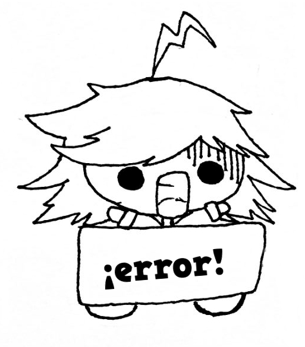

14         Excepciones
======================



A estas alturas puede que ya seas excelente en programación. Pero aún así, tus programas pueden seguir fallando, porque hay cosas que escapan al control de tu programa y hacen que tu programa deje de funcionar. Por ejemplo, si tu programa espera que el usuario escriba un número pero este escribe letras o no escribe nada, tu programa fallará. Si tu programa tiene que leer un fichero pero este fichero no existe, tu programa fallará. Si tu programa necesita conectarse a la red pero tu ordenador no está conectado, tu programa fallará. Como puedes ver, hay situaciones sobre las que el programa no puede tener control. Por suerte tenemos un mecanismo que nos permite que si se produce una de esas sesiones, al menos nuestro programa no falle y termine sin más. Y ese mecanismo son las Excepciones.

14.1 Excepciones en Python
--------------------------

Por ejemplo, supongamos que tenemos un programa muy simple como el siguiente, en el que se le pide un número al usuario y se hace una multiplicación:

```Python
valor = input("Sartu zenbaki bat:")
valor = int(valor)
cuadrado = valor  * valor
print("El cuadrado es: ", cuadrado)
```

Si el usuario introduce lo que no debe, veremos lo siguiente:

```Python
Sartu zenbaki bat:x
Traceback (most recent call last):
  File "saltaexcepcion.py", line 2, in <module>
    valor = int(valor)
ValueError: invalid literal for int() with base 10: 'x'
```

Mediante una excepción, podemos evitar que el programa falle estrepitosamente y al menos mostrar un mensaje de error al usuario. La excepción es una estructura más en el lenguaje, y tiene la siguiente forma:

```Python
try:
    código _que _puede _fallar
except:
    código _que _se _ejecuta _si _hay _error
```

Veamos el ejemplo anterior, protegiendo el código sensible dentro del bloque de excepción:

```Python
valor = input("Sartu zenbaki bat:")

try:
    valor = int(valor)
    cuadrado = valor  * valor
    print("El cuadrado es: ", cuadrado)
except:
    print("Error al convertir dato!")
```

Ahora si se mete un dato incorrecto, veremos lo siguiente:

```console
Sartu zenbaki bat:x
Error al convertir dato!
```

También se podría mejorar el programa para que volviera a intentar solicitar el valor y no terminar.

Existen excepciones específicas según el tipo de error, las cuales se pueden usar para mostrar un mensaje de error más específico.